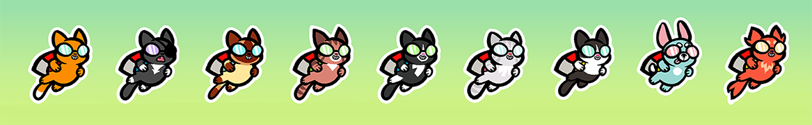

---
meta:
  - name: description
    content: Crocodile Cat is a one touch action/stratagy/timing mobile game where you have to escape the jaws of a crocodile and rescue kittens with the use of your trusty jetpack and some explosive pickups.
  - name: keywords
    content: Crocodile Cat
thumb: /img/croc-cat-thumb.png
featured: true
featured_thumb: /img/croc-cat-featured.png
---

# Crocodile Cat

Crocodile Cat is a one touch action/stratagy/timing mobile game where you have to escape the jaws of a crocodile and rescue kittens with the use of your trusty jetpack and some explosive pickups.
Crocodile Cat is being made with [Michael Bowerman](http://www.embow.co.uk/) in Unity.

Read more about the development of Crocodile cat on [Michael's Blog](http://blog.embow.co.uk/).

