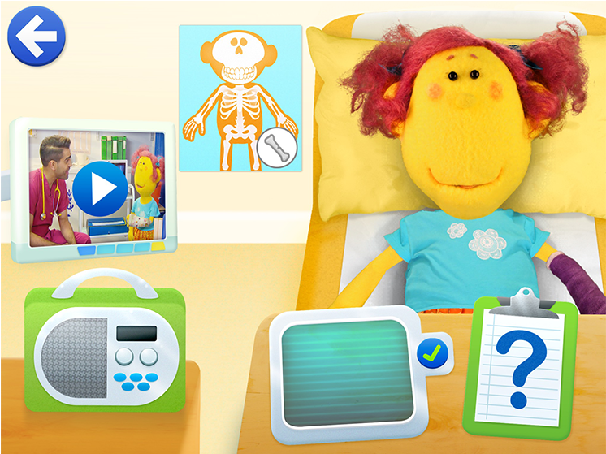
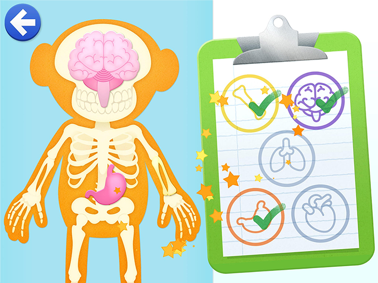
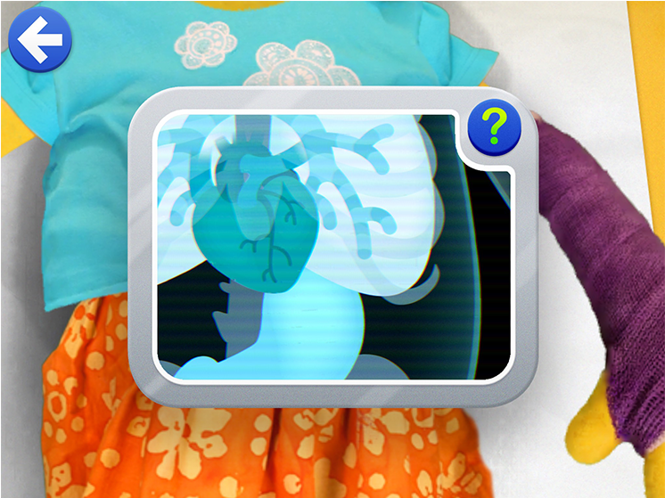

# Get Well Soon Hospital

Based off of the titular Cbeebies tv series, Get Well Soon Hospital is a app made with the help of the Wellcome Trust, to help familiarise children with going into the hospital.

I was a 2D artist on this project, whilst working for [Plug-In Media](http://www.pluginmedia.net/), and was responsible for game art and UI design. The App was awarded a Children’s BAFTA for the Interactive: Adapted category in 2016

[Play the web game](https://www.bbc.co.uk/cbbc/games/operation-ouch-clonewards-game)

