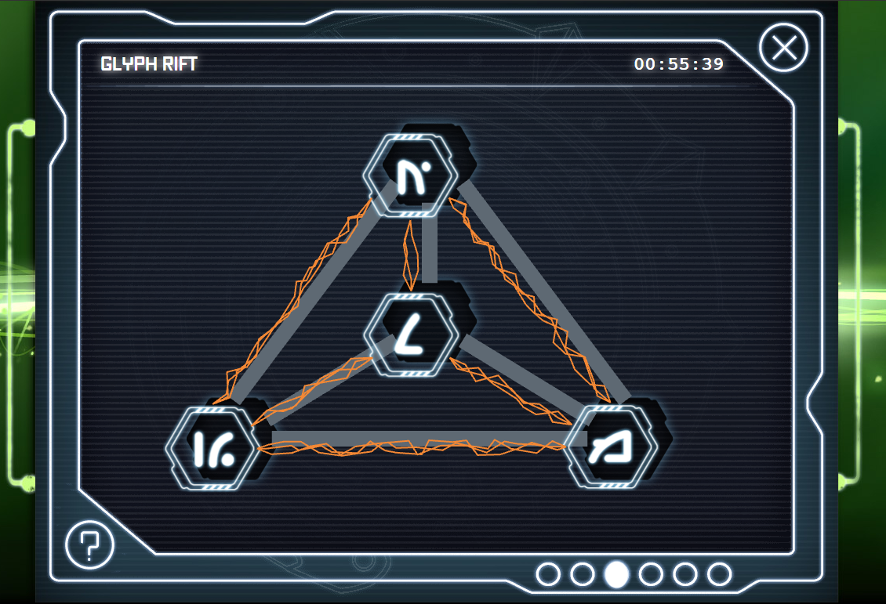
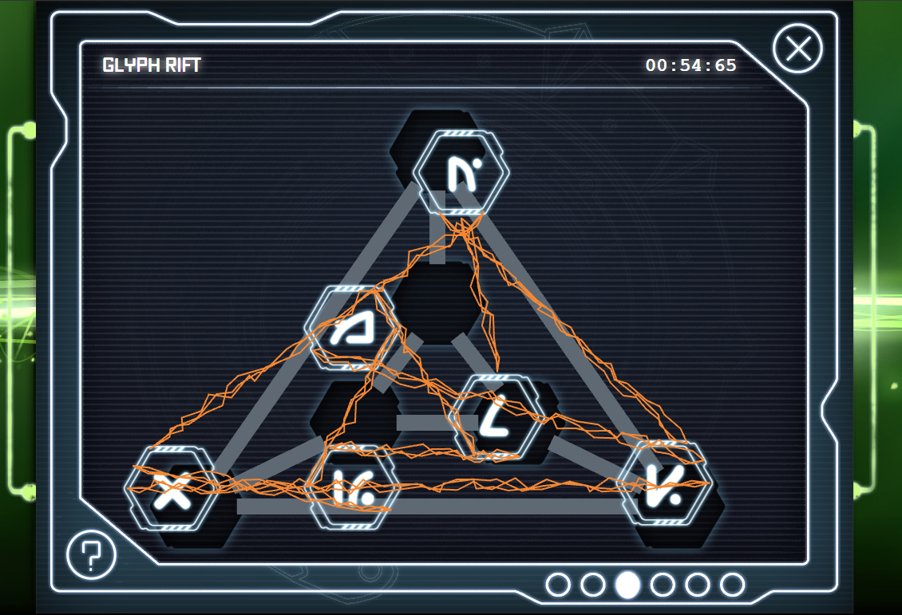
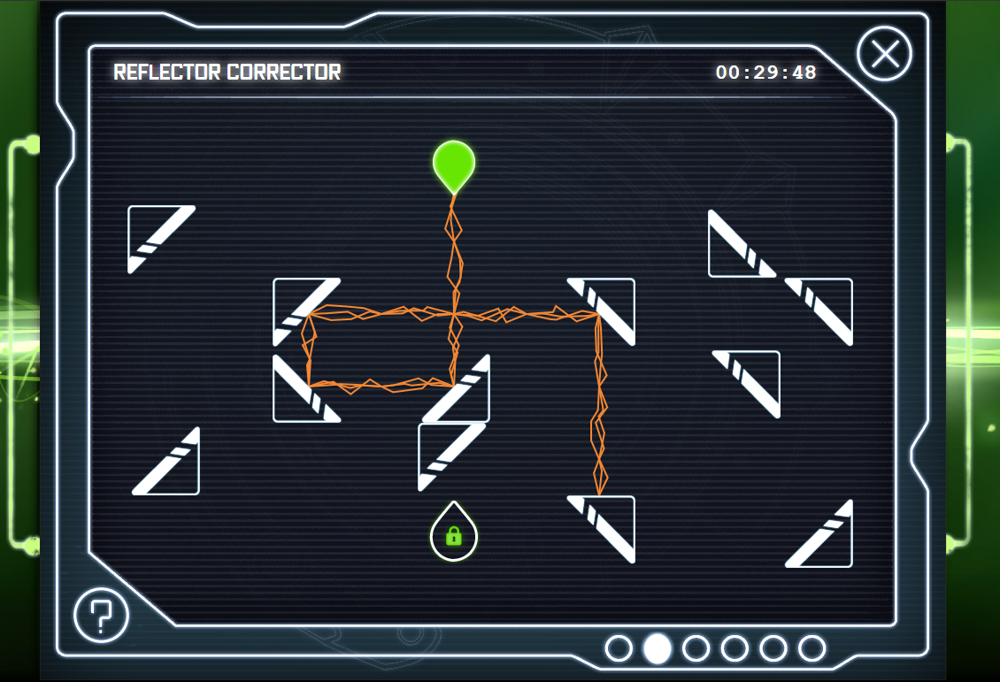
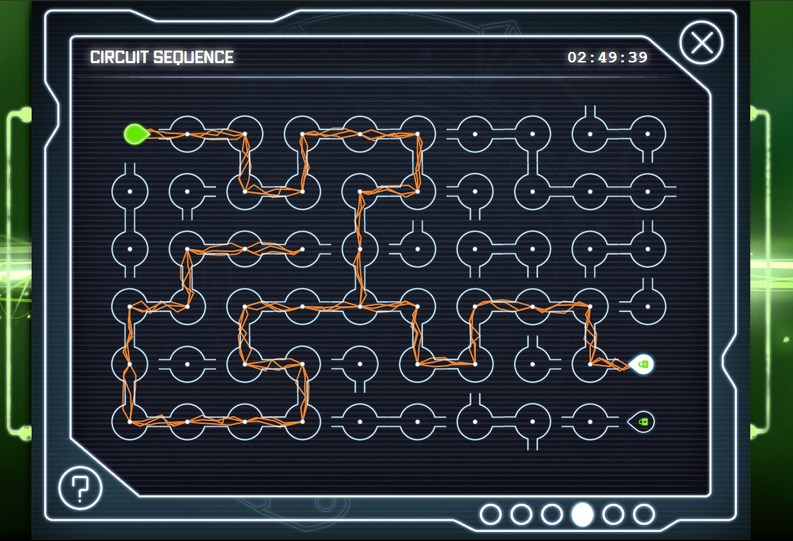

# Invizimals Hacking Challenge

The Invizimals Hacking Challenge is a suite of mini games developed in order to promote the PS Vita title "Invizimals: The Resistance".

I was a 2D artist on this project, whilst working for [Plug-In Media](http://www.pluginmedia.net/), and was responsible for mini-game art and UI design.

