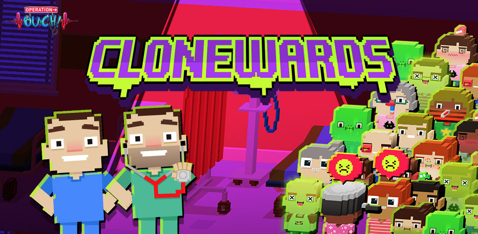
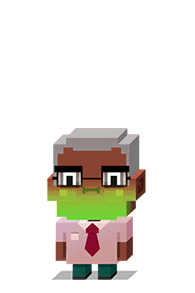
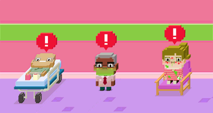
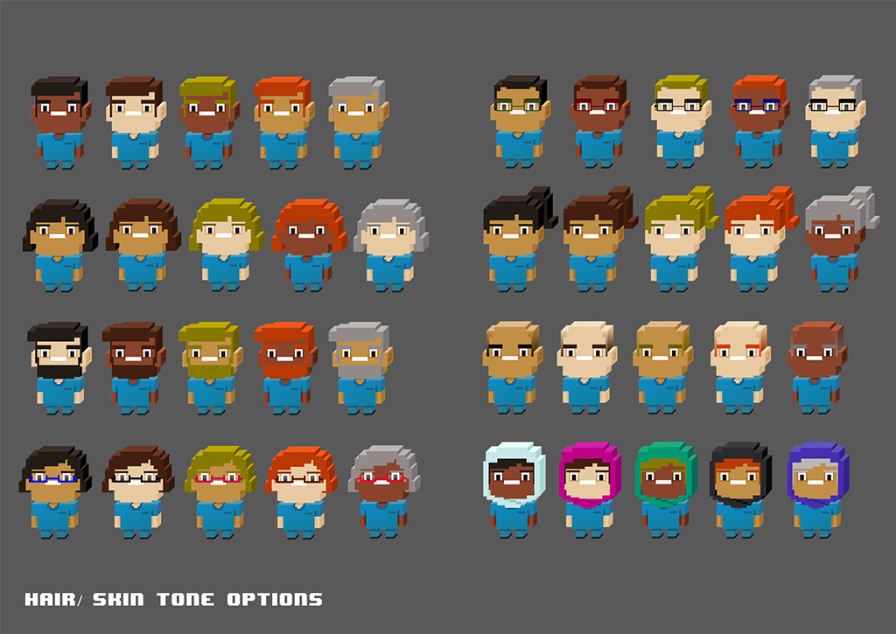
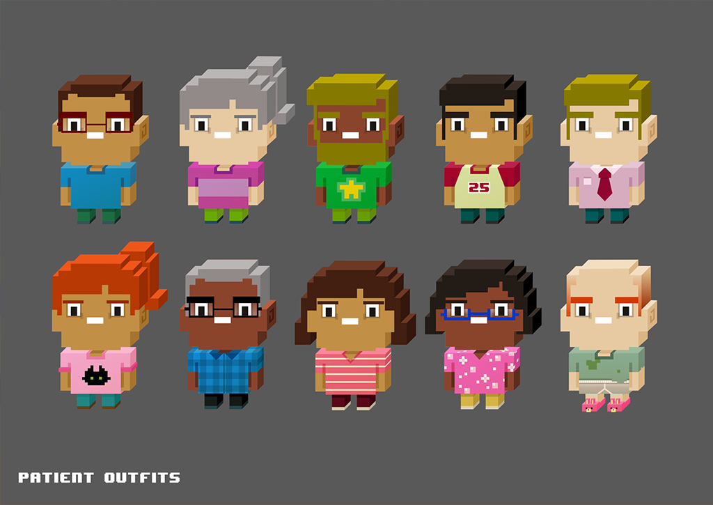
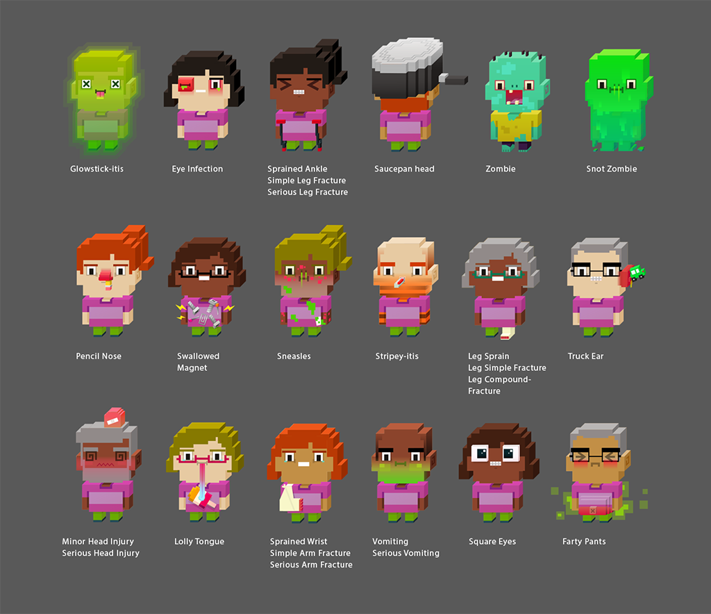
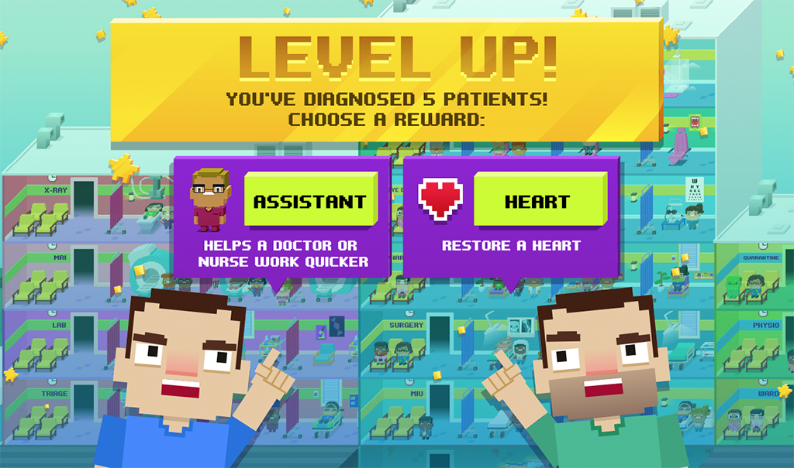
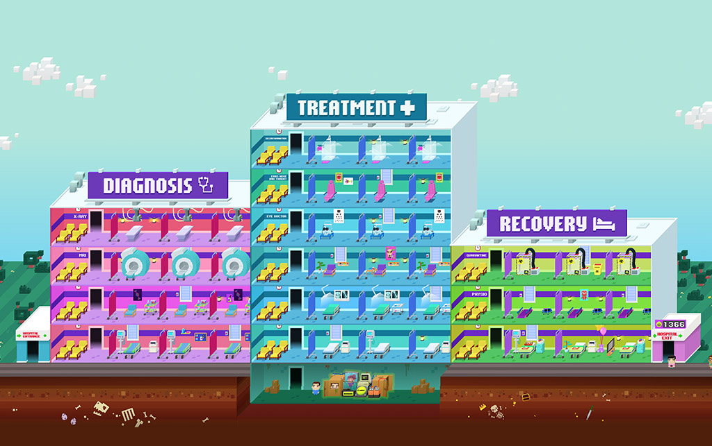
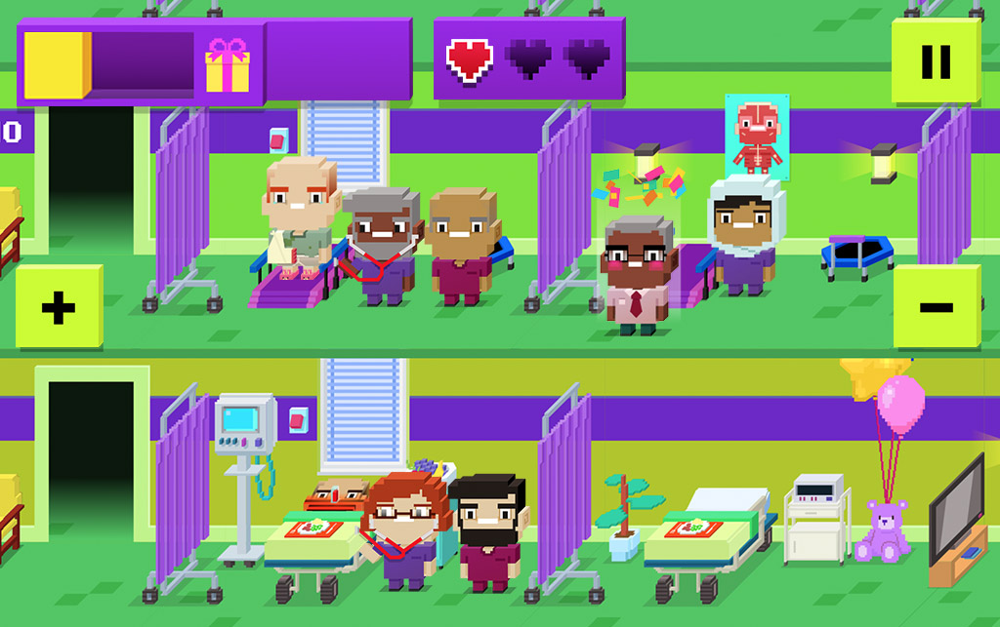

# Operation Ouch: Clone Wards

Clonewards is a HTML5 hospital-management game commissioned by the BBC for their award winning children's television show, Operation Ouch. With the help of Dr Chris, Dr Xand and a very broken cloning-machine the player must keep their hospital running smoothly ...or risk a snot-splosion.

I was lead artist on this project, whilst working for [Plug-In Media](http://www.pluginmedia.net/).
As lead artist I was responsible for creating a modular system of randomized and customizable Hospital Staff, Patients and Hospital Rooms, as well as UI design, animation and particle assets.

[Play the Game.](https://itunes.apple.com/gb/app/get-well-soon-hospital-with-dr-ranj/id1074359240?mt=8)

