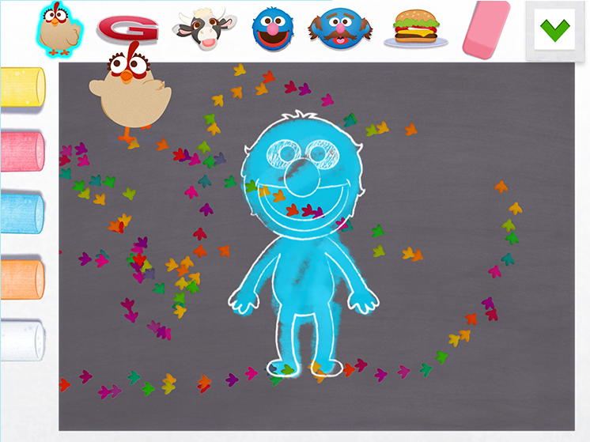

---
meta:
  - name: description
    content: Sesame Street - Elmo's Art Maker is a drawing game available as both an iPad app, and a HTML5 game.
  - name: keywords
    content: Sesame Street, Elmo's Art Maker
thumb: /img/elmo-thumb.png
---

# Sesame Street: Elmo's Art Maker

Sesame Street: Elmo's Art Maker is a drawing game available as both an iPad app, and a HTML5 game.

Made concurrently, I had the pleasure of working on both the iPad app & HTML5 version of the game as the 2D artist on this project, whilst working for [Plug-In Media](http://www.pluginmedia.net/). As 2D artist I was responsible for creating drawing tool designs and assets, canvas designs, UI & animation in Unity

[Play the Web Game](https://www.sesamestreet.org/art-maker/)

[Download the App](https://itunes.apple.com/us/app/sesame-street-art-maker/id903134597?mt=8/)

